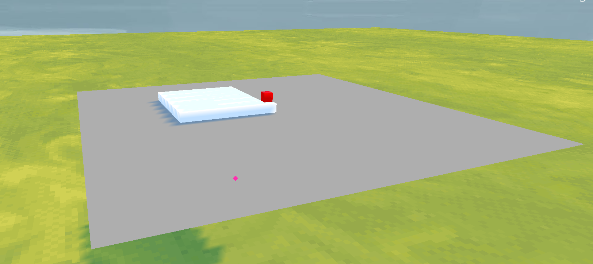
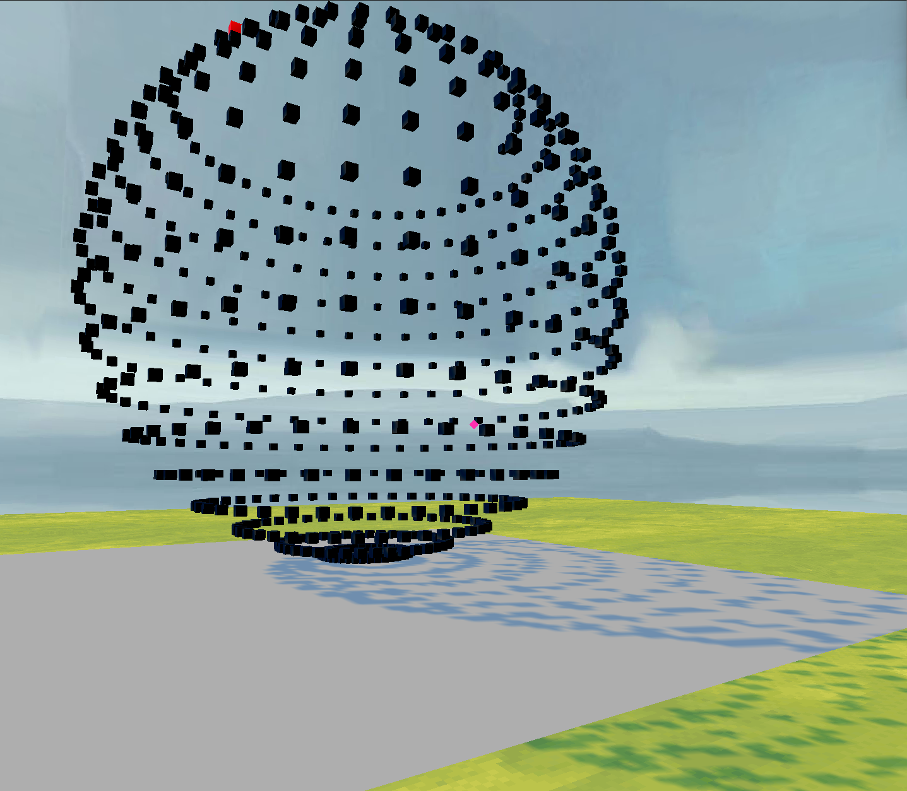

# 3D Printer Simulator
Aplikacja Symulująca działanie drukarki 3d

Aplikacja umożliwia:
- zmiane położenia kamery za pomocą myszki i guzików wsad
- generowanie podstawowych kształtów do drukowania:
    - Sześcianu
    - Kuli
- otwarcie menu przyciskiem "m"
- menu:
    - umożliwia zmianę parametrów podstawowych figur:
        - Sześcian:
            - zmiana długości boku
        - Kula:
            - zmiana promienia kuli
            - zmiana ilości warstw w pionie
            - zmiana ilości punktów na warstwę
- klawisze:
    - m - otwiera menu, pauzuje druk 3d
    - q - zamyka program
    - r - usuwa wydrukowany element i dysze
    - p - pauzuje/startuje wydruk
